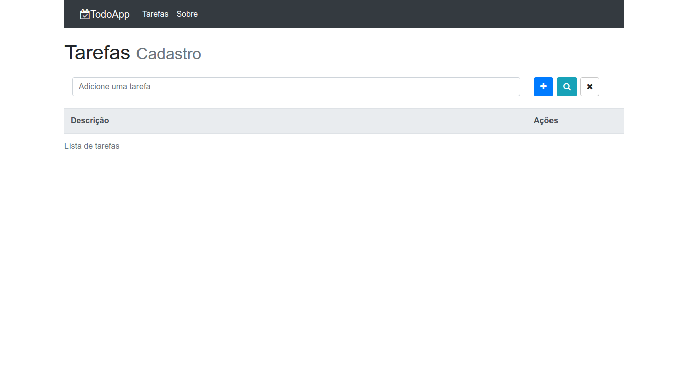
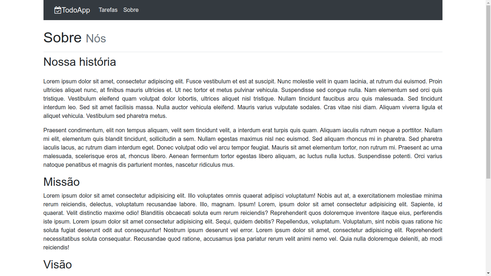
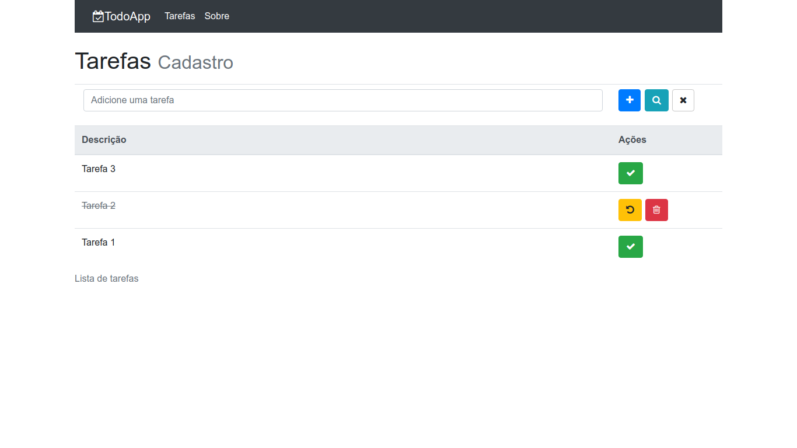

# TODO LIST APP

Classic to-do list project. This application was made for learning purposes. Essentially, it aims to use ReactJs, Redux and many other Web technologies concepts. See ["Built With"](#built-with) section for more details.

## GETTING STARTED 🚀

These instructions will get you a copy of the project up and running on your local machine for development purpose.

### PREREQUISITES 📋

- [Node Js](https://nodejs.org/) and npm - A JavaScript runtime built on Chrome's V8 JavaScript engine.
- [MongoDB](https://www.mongodb.com/) up and running - A general purpose, document-based and distributed database.

### INSTALLING 🔧

Clone this repository by pasting this command on your terminal/prompt:

```
git clone https://github.com/FranSantiago/todo_list.git
```

Change to the new repository:

```
cd todo_list
```

If Node.js is installed, then, install packages dependencies with npm in the frontend directory:

```
cd frontend/ && npm i
```

then, install packages dependencies with npm in the backend directory:

```
cd ../backend/ && npm i
```

Create a .env file in the backend directory by copying .env.example:

```
cp .env.example .env
```

Start the server by typing:

```
npm run dev
```

Now, open a new termial window, change to the frontend directory and type:

```
npm start
```

You will "get" the home page as follows (language: pt-br):



## NOTES

This application has two routes:

- "/" - to home page, todo-list
- "/about" - to about section, a dummy page just for using react-router-dom lib

## SHORTCUTS

- ENTER - adds a new task in the list
- SHIFT + ENTER - searches for tasks that include the text in the input
- ESC - clears the text in the input

## SCREENSHOTS




## BUILT WITH

- Axios
- Bootstrap
- Cors
- Express Framework
- FontAwesome
- MongoDB
- Mongoose
- ReactJS
- React-router-dom
- React-redux
- Redux
- Redux-multi
- Redux-thunk

## AUTHOR

- **Françoar Santiago** - _Full Stack developer_ - [@fransantiago](https://github.com/fransantiago) on GitHub

## LICENSE 📄

This project is licensed under the MIT License - see the [LICENSE.md](LICENSE.md) file for details
